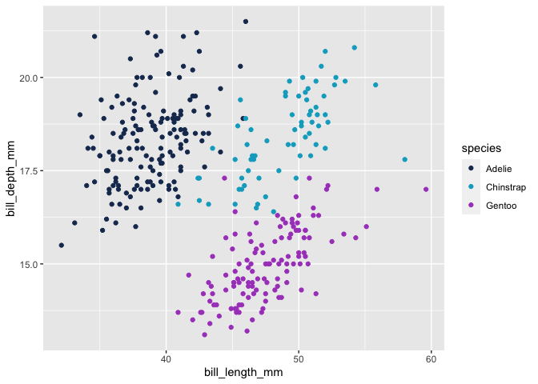
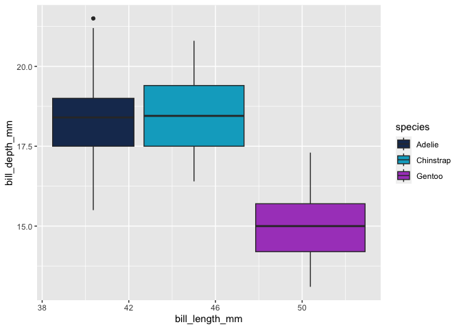
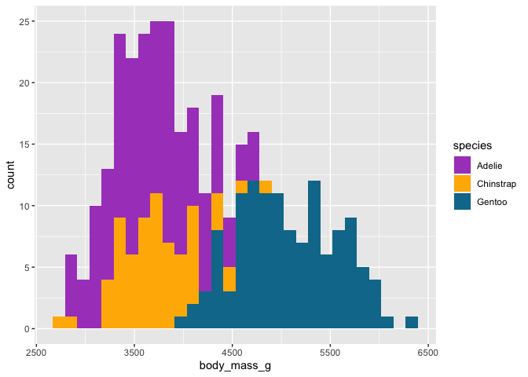
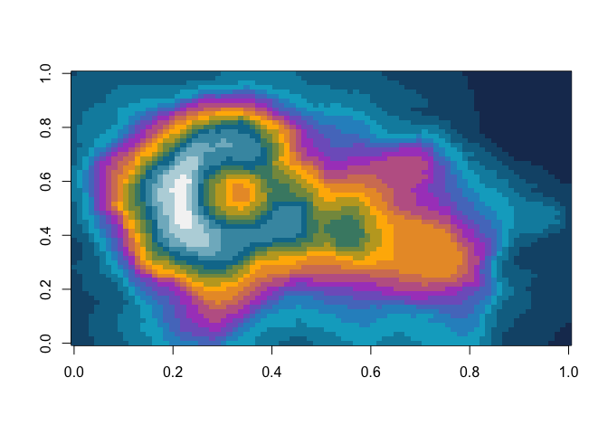

<!-- README.md is generated from README.Rmd. Please edit that file -->

# hutchpal

<!-- badges: start -->

[](https://github.com/fhdsl/hutchpal/actions/workflows/R-CMD-check.yaml)
<!-- badges: end -->

Make plots with Fred Hutch colors.

## Installation

``` r
remotes::install_github("fhdsl/hutchpal")
```

## Getting Started

``` r
library(ggplot2)
library(palmerpenguins)
library(hutchpal)

# scale_color_hutch() for lines and points

penguins |>
  ggplot(aes(bill_length_mm, bill_depth_mm, color = species)) +
  geom_point() +
  scale_color_hutch()
```



``` r
# scale_fill_hutch() for box plot, bar plot, etc.

penguins |>
  ggplot(aes(bill_length_mm, bill_depth_mm, fill = species)) +
  geom_boxplot() +
  scale_fill_hutch()
```



``` r
penguins |>
  ggplot(aes(body_mass_g, fill = species)) +
    geom_histogram() +
    scale_fill_hutch(colors = names(hutch_colors())[3:5])
```



``` r
image(volcano, col = hutch_palette()(21))
```


